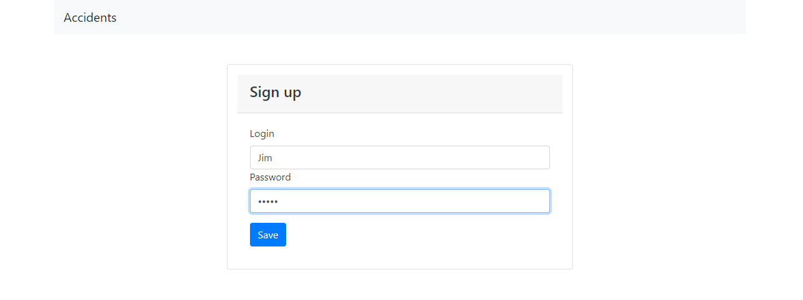
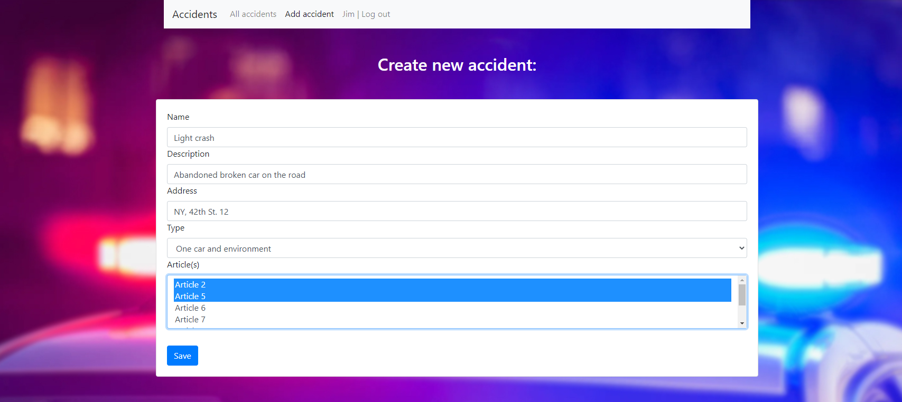

# job4j_accidents

# About

- This application is a traffic violation ticket system
- User can add a violation ticket to system
- User can update added violation tickets
- Tickets have name, description, address, type and articles of the law
- ! The code of this app contains several configurations and repository implementations (for training) !

***

# Used technologies

<ul>
 <li>JDK 17</li>
 <li>Maven 3.8.5</li>
 <li>Spring Boot 2.7.3</li>
 <li>Spring Web 2.7.3</li>
 <li>Spring Data JPA 2.7.2</li>
 <li>Spring Security 5.7.3</li>
 <li>JDBC 4</li>
 <li>Bootstrap 4.4.1</li>
 <li>Thymeleaf 2.7.3</li>
 <li>Lombok 1.18.22</li>
 <li>PostgreSQL 42.2.27</li>
 <li>Liquibase 3.6.2</li>
 <li>JUnit 5</li>
 <li>Mockito 4.5.1</li>
 <li>AssertJ 3.22.0</li>
 <li>H2 1.4.200</li>
</ul>

***

# Environment requirements

<ul>
 <li>Create .jar file via maven command "mvn package"</li>
 <li>Go to the Target folder and check the presence of "job4j_accidents-1.0-SNAPSHOT.jar" file</li>
 <li>Open the command line, go to the Target folder</li>
 <li>Run this file through "java -jar job4j_accidents-1.0-SNAPSHOT.jar" command</li>
 <li>Then go to the http://localhost:8080/index page</li>
</ul>

***

# Screenshots

- Sign up page:
  
- Log in page:
  
- Start page:
  
- Accident adding page:
  
- All accidents page:
  
- Update accident page:
  
- All accidents page after updating:
  
- Log out page:
  

***

# Todo list

- Admin panel (implement admin features)
- Ticket statuses
- Ticket deletion by admin
- User must update only tickets added by him
- Cover the code to unit tests (add more tests)

***

# Contact

Contact me if you have any questions: itfedorovsa@gmail.com

